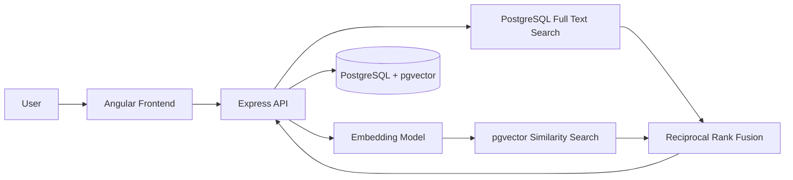
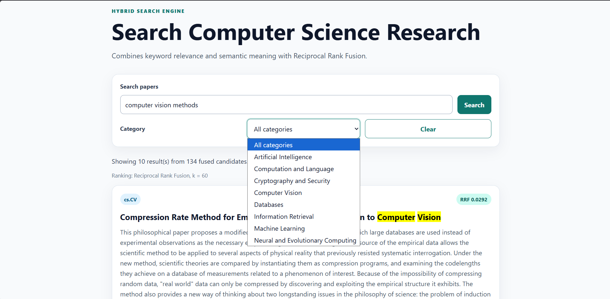

# Hybrid Search Engine

A full-stack hybrid search engine for Computer Science research papers.

It combines:

- PostgreSQL Full Text Search for exact keyword matching
- Local embeddings for semantic similarity search
- pgvector for vector storage and cosine similarity
- Reciprocal Rank Fusion (RRF) for hybrid ranking
- Angular frontend for searching and filtering results

## Features

- Keyword search using PostgreSQL `tsvector`, `tsquery`, GIN indexes, and `ts_rank_cd`
- Semantic search using the free local `Xenova/all-MiniLM-L6-v2` embedding model
- pgvector cosine similarity search with an HNSW index
- Hybrid retrieval using Reciprocal Rank Fusion
- Category filters, pagination, sorting, and result highlighting
- Input validation, error handling, rate limiting, security headers, and tests
- Around 75,000 arXiv Computer Science research-paper records

## Architecture


## Search Flow

1. The user enters a search query.
2. PostgreSQL Full Text Search retrieves keyword candidates.
3. The embedding model converts the query into a 384-dimensional vector.
4. pgvector retrieves semantically similar candidates.
5. Reciprocal Rank Fusion combines both ranked lists.
6. Angular displays the final ranked results.



## Tech Stack

| Layer | Technology |
| --- | --- |
| Frontend | Angular, TypeScript, CSS |
| Backend | Node.js, Express.js, TypeScript |
| Database | PostgreSQL, pgvector |
| Keyword Search | PostgreSQL Full Text Search, GIN index |
| Semantic Search | HNSW index, cosine similarity |
| Embeddings | Transformers.js, Xenova/all-MiniLM-L6-v2 |
| Testing | Vitest, Supertest |
| Dataset | arXiv Computer Science paper metadata |

## Important Design Decisions

### Why not SQL `LIKE`?

`LIKE` only checks text patterns. PostgreSQL Full Text Search is faster for large text collections and understands stemming, stop words, and inverted indexes.

### Why not add keyword and semantic scores?

Keyword ranking and semantic similarity use different score scales. Adding them directly is unreliable.

Instead, this project uses Reciprocal Rank Fusion:

```text
RRF score = 1 / (k + rank)
```

RRF combines result positions rather than incompatible raw scores.

### Is `ts_rank_cd` exact BM25?

No. `ts_rank_cd` is PostgreSQL lexical ranking. It has a similar purpose to BM25, but it is not exact BM25 because it does not use all corpus-wide BM25 statistics.

## Run Locally

### Start PostgreSQL

```powershell
docker compose up -d
```

### Start the API

```powershell
cd apps/api
npm install
npm run dev
```

### Start the frontend

```powershell
cd apps/web
npm install
npm start
```

Open:

```text
http://localhost:4200
```

## Scaling Notes

- GIN indexes speed up keyword retrieval.
- HNSW indexes speed up approximate vector similarity search.
- At millions of documents, use background embedding jobs, queues, keyset pagination, replicas, and possibly a dedicated search platform.

## Current Hosting Status

The complete project runs locally.

A temporary public demo can be shared through Cloudflare Tunnel while the local laptop is running. Permanent public hosting was not added because the full PostgreSQL, pgvector, and embedding workload exceeds reliable no-card free hosting limits.

## What I Learned

- Full Text Search and inverted indexes
- Lexical versus semantic retrieval
- Embeddings and cosine similarity
- pgvector and HNSW indexes
- Reciprocal Rank Fusion
- PostgreSQL query plans and index trade-offs
- API validation, security, testing, and Angular integration

## License

MIT
